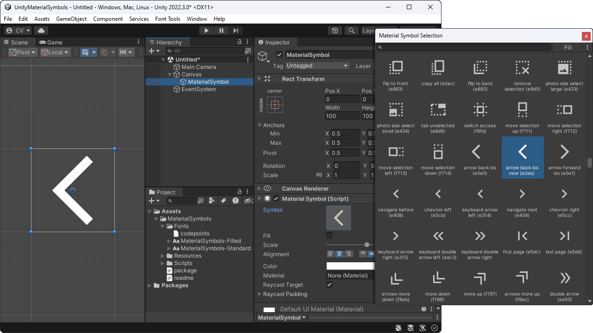
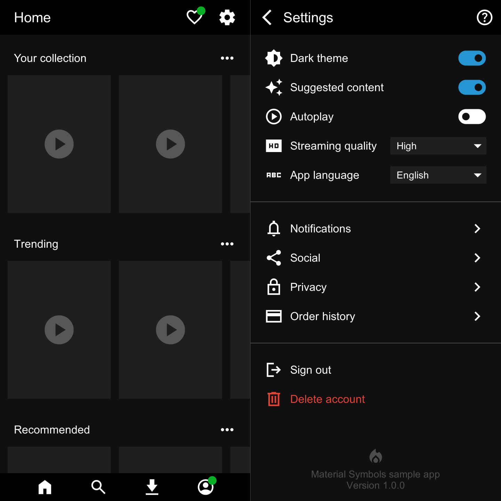
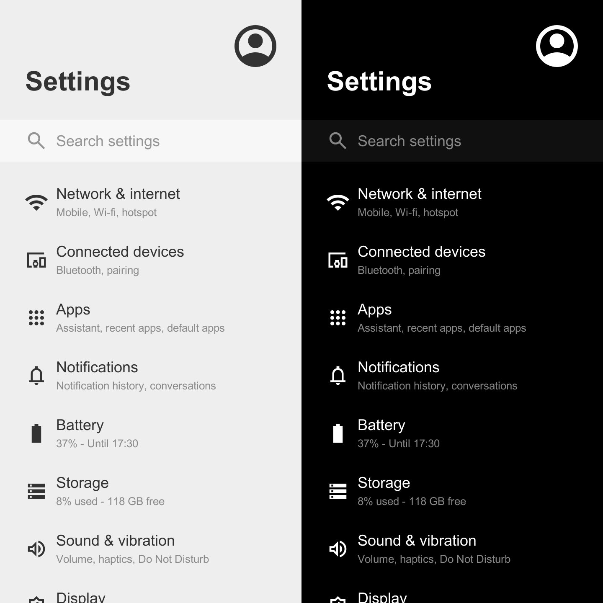
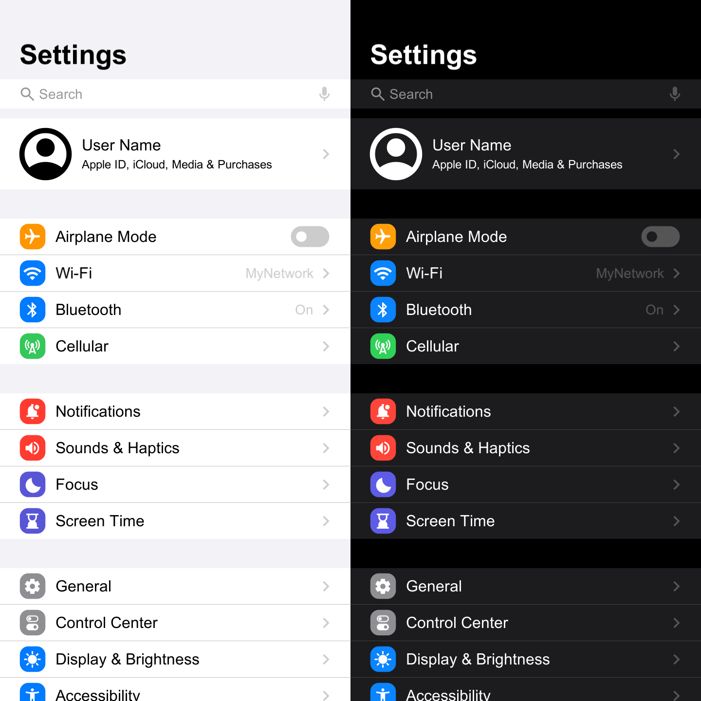

# Material Symbols (Icons) for Unity

[](http://makeapullrequest.com)

Add-on that simplifies the usage of Google's **Material Symbols** (previously known as Material Icons) on Unity. The motivation is to have a lightweight set of uniform icons in order to provide the same design throughout the application UI, improving UX.

Recommended Unity versions are 2022 or higher.\
Supported Unity versions are 2017 or higher.

<a href='https://raw.githubusercontent.com/convalise/unity-material-symbols/master/doc/preview.png'></a>

## Samples Gallery

<a href='https://raw.githubusercontent.com/convalise/unity-material-symbols/master/doc/sample-1.png'></a> <a href='https://raw.githubusercontent.com/convalise/unity-material-symbols/master/doc/sample-2.png'></a> <a href='https://raw.githubusercontent.com/convalise/unity-material-symbols/master/doc/sample-3.png'></a>


## Changes

Initial Forked Version -  `v226.0.0`

Based on the original project by [Convalise](https://github.com/convalise)\
URL: https://github.com/convalise/unity-material-symbols

This forked version introduces significant [updates](https://github.com/ebukaracer/UnityMaterialSymbols/blob/main/NOTICE.md#changes-made-in-the-feature-branch) organized into this: [branch](https://github.com/ebukaracer/UnityMaterialSymbols/tree/feature)

## Installation

- Hit `(+)` and select `Add package from Git URL(Unity 2019.4+)` 
- Paste the `git URL`: https://github.com/ebukaracer/UnityMaterialSymbols.git#feature
- Hit `Add`
-  If you're using assembly definition in your project, ensure to add this package's reference: `Racer.MaterialSymbols`, under **Assembly Definition References**

## Quick Usage

Simply add the `MaterialSymbol` component to your UI GameObject and you are good to go.

Alternatively, a new object can be added to the scene by right-clicking on the hierarchy window and selecting `UI > Google > New Material Symbol`.

The inspector provides a window to easily select between the available symbols or icons.

---

The `MaterialSymbol` class inherits from `UnityEngine.UI.Text`, so it has all properties and methods available [here](https://docs.unity3d.com/Packages/com.unity.ugui@1.0/manual/script-Text.html) such as `color` and `raycast target`.

Each icon is composed by a pair of a [unicode-escaped char](https://learn.microsoft.com/en-us/dotnet/csharp/language-reference/builtin-types/char#literals) and a Boolean representing the glyph code and the fill status respectively.

The icon can be set programmatically by setting the `Symbol` field with a new `MaterialSymbolData` object:
```cs
public class Demo : MonoBehaviour  
{  
    private MaterialSymbol _materialSymbol;

	private void Start()  
	{  
	    _materialSymbol.Symbol = new MaterialSymbolData('\uEF55', false);  
	}
}
```

It can also be set directly by setting the `Code` and `Fill` properties:
```cs
_materialSymbol.Code = '\uEF55';  
_materialSymbol.Fill = false;
```

Additionally, a serialized `MaterialSymbolData` field can be used to bring the `Symbol` inspector on any class:
```cs
public class Demo : MonoBehaviour  
{  
    private MaterialSymbol _materialSymbol;
    
    [SerializeField]
    private MaterialSymbolData symbolData;

	private void Start()  
	{  
		_materialSymbol.Symbol = symbolData;  
		_materialSymbol.color = Color.blue;
	}
}
```

## Credits

This project was created by Conrado (https://github.com/convalise) as an improvement of the deprecated [Unity Material Icons](https://github.com/convalise/unity-material-icons).

It makes usage of the [Material Design icons by Google (Material Symbols)](https://github.com/google/material-design-icons).\

More information on the Google's project can be found at the [Material Symbols Guide](https://developers.google.com/fonts/docs/material_symbols).

See [FAQs](https://github.com/convalise/unity-material-symbols#FAQ)